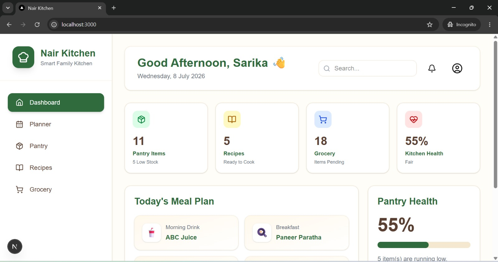
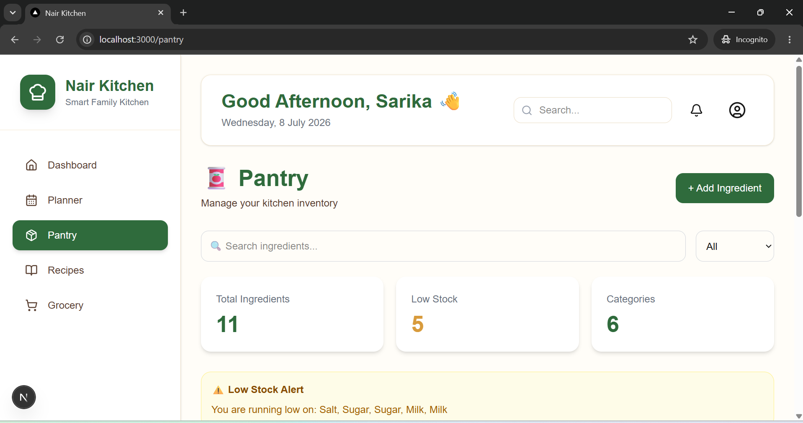
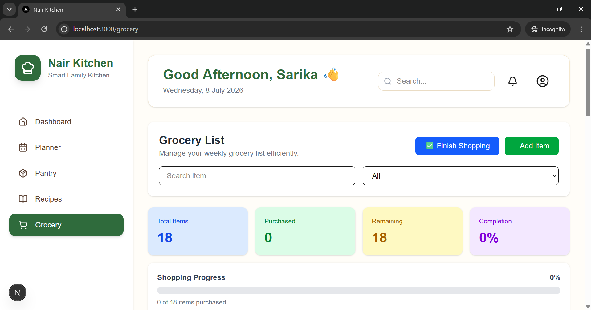
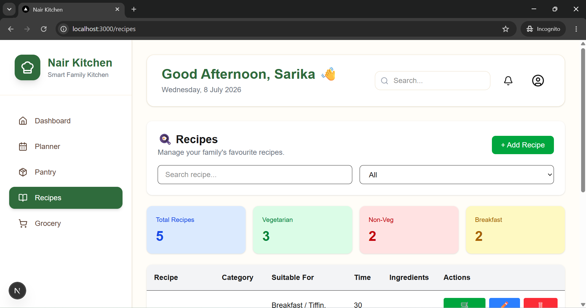
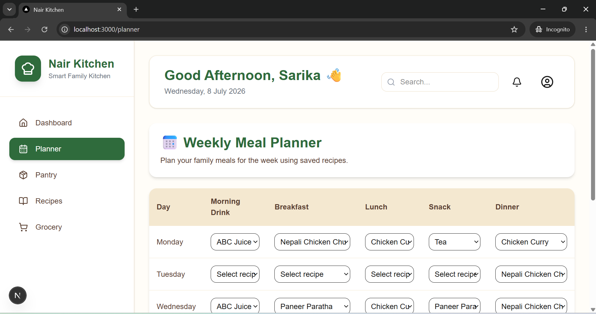

# 🍽️ Nair Kitchen


A modern **Smart Family Kitchen Management System** built with **Next.js**, **React**, **TypeScript**, and **Tailwind CSS**.

Nair Kitchen brings meal planning, Recipe management, Pantry inventory, Grocery shopping, household Grocery budgeting, and regional preferences together in one responsive application.

---

# 💡 Why Nair Kitchen?

Planning meals for a family often requires using separate notes, shopping lists, Recipe apps, Pantry trackers, and expense records.

Nair Kitchen was created to bring these everyday kitchen activities together in one organized application.

The app helps families:

- Plan meals for the entire week.
- Organize Recipes and ingredients.
- Track Pantry stock and low-stock items.
- Generate Grocery requirements from planned meals.
- Complete Grocery shopping and automatically update the Pantry.
- Record Grocery expenses and monitor a monthly budget.
- Use country-aware Grocery store suggestions.
- Customize currency, date format, measurement system, and other preferences.

The project was created to solve a real household need while also serving as a hands-on learning journey in modern full-stack web application development.

---

# 📊 Current Status

| Module | Status |
|---|---|
| 🏠 Dashboard | ✅ Complete |
| 📅 Weekly Meal Planner | ✅ Complete |
| 🍳 Recipe Management | ✅ Complete |
| 🥫 Pantry Management | ✅ Complete |
| 🛒 Smart Grocery | ✅ Complete |
| 💰 Grocery Budget | ✅ Complete |
| 👤 User Profile | ✅ Complete |
| ⚙️ Settings & Regional Preferences | ✅ Complete |
| 🔔 Notification Centre | ✅ Complete |
| 📱 Responsive Mobile Experience | ✅ Complete |
| 🌍 Region-Aware Store System | ✅ Complete |
| 💱 Worldwide Currency Support | ✅ Complete |
| 📆 App-Wide Date Formatting | ✅ Complete |
| 💾 Data Backup & Restore | 📋 Planned |
| 📲 Native Mobile Application | 📋 Planned |
| 🤖 AI Kitchen Features | 💡 Future Release |

---

# 📸 Application Preview

## 🏠 Dashboard



---

## 🥫 Pantry Management



---

## 🛒 Grocery Management



---

## 🍳 Recipe Management



---

## 📅 Weekly Meal Planner



---

> Additional screenshots for Budget, Profile, Settings, mobile views, and regional features will be added as the product branding and release assets are finalized.

---

# ✨ Features

## 🏠 Smart Dashboard

- Time-based personal greeting.
- Current date using the selected Date Format.
- Dynamic Pantry statistics.
- Recipe count.
- Pending Grocery count.
- Kitchen Health percentage.
- Today’s Meal Plan.
- Monthly Grocery Budget summary.
- Budget spending and remaining balance.
- Quick Actions.
- Profile name, role, and image.
- Notification Centre for Pantry, Grocery, and Planner alerts.

## 📅 Weekly Meal Planner

- Seven-day meal planning.
- Morning Drink.
- Breakfast.
- Lunch.
- Snack.
- Dinner.
- Recipe-based meal selection.
- Meal-type-aware Recipe filtering.
- Immediate Recipe-to-Planner synchronization.
- Persistent meal selections.
- Automatic Grocery generation from planned Recipes.
- Ingredient aggregation to reduce duplicate Grocery entries.

## 🍳 Recipe Management

- Add, edit, and delete Recipes.
- Recipe categories.
- Multiple suitable meal types.
- Cooking-time information.
- Ingredient names, quantities, and units.
- Cooking instructions.
- Recipe search.
- Category filtering.
- Planner integration.
- Grocery-generation integration.
- Persistent Recipe storage.

## 🥫 Pantry Management

- Add, edit, and delete Pantry ingredients.
- Ingredient categories.
- Quantity and unit tracking.
- Minimum-stock levels.
- Automatic Good and Low stock status.
- Low-stock alerts.
- Ingredient notes.
- Pantry search.
- Category filtering.
- Automatic quantity updates after Grocery Checkout.
- Automatic addition of newly purchased ingredients.
- Dynamic Kitchen Health calculation.

## 🛒 Smart Grocery

- Add, edit, and delete Grocery items.
- Grocery search.
- Category filtering.
- Purchased and remaining item tracking.
- Shopping progress statistics.
- Grocery completion percentage.
- Mobile-friendly Checkout Bottom Sheet.
- Shopping-date selection.
- Grocery bill recording.
- Shopping notes.
- Region-aware store suggestions.
- Recently used stores.
- Last-used store memory.
- Custom Grocery stores.
- Automatic transfer of purchased items to Pantry.
- Unpurchased items remain in the Grocery list.
- Automatic Grocery expense creation.
- Shopping-session storage.

## 💰 Grocery Budget

- Monthly Grocery Budget.
- Monthly spending calculation.
- Remaining-budget calculation.
- Over-budget status.
- Budget usage percentage.
- Dynamic progress indicator.
- Monthly Transaction History.
- Grocery store information.
- Transaction date.
- Description and notes.
- Purchased-item count.
- Edit Grocery transactions.
- Delete confirmation.
- Automatic recalculation after transaction changes.
- Currency preference integration.
- Date-format preference integration.

## ⚙️ Settings & Regional Preferences

- Worldwide country selection.
- Searchable worldwide Currency Picker.
- Search by currency code, name, or symbol.
- Region-aware Grocery store suggestions.
- Generic fallback stores for countries without predefined store lists.
- Custom and recently used Grocery stores.
- Currency integration across Dashboard, Grocery, and Budget.
- Date Format options:
  - `DD/MM/YYYY`
  - `MM/DD/YYYY`
  - `YYYY-MM-DD`
- Week-start preference.
- Measurement-system preference.
- Notification preferences.
- Persistent Settings storage.

## 👤 User Profile

- Editable user name.
- Editable role.
- Profile image.
- Initial-based avatar fallback.
- Profile integration with the application header.
- Persistent profile information.

## 📱 Responsive Experience

- Responsive desktop, tablet, and mobile layouts.
- Mobile navigation drawer.
- Sticky mobile page headers.
- Mobile search and category filters.
- Mobile Floating Action Buttons.
- Mobile Planner cards.
- Touch-friendly controls.
- Reusable mobile components.
- Mobile-friendly Bottom Sheets.
- Responsive cards, forms, tables, and dialogs.

---

# 🛠️ Tech Stack

- Next.js 16
- React 19
- TypeScript 5
- Tailwind CSS 4
- Context API
- Browser Local Storage
- Lucide React Icons
- Turbopack
- Git
- GitHub

---

# 🏗️ Application Architecture

Nair Kitchen currently uses a client-side architecture with shared React Context and browser Local Storage.

Core application data includes:

- Pantry items.
- Recipes.
- Grocery items.
- Weekly meal plans.
- Grocery budgets.
- Grocery transactions.
- Shopping sessions.
- User profile.
- Regional and application preferences.

Shared utilities and services support:

- Ingredient aggregation.
- Grocery generation.
- Pantry updates after shopping.
- Regional Grocery store suggestions.
- Custom and recently used stores.
- Worldwide countries and currencies.
- App-wide date formatting.
- Persistent application state.

---

# 📂 Project Structure

```text
app/
components/
├── common/
├── dashboard/
├── grocery/
├── mobile/
├── pantry/
├── planner/
├── profile/
├── recipes/
├── shopping/
└── ui/

constants/
context/
data/
docs/
hooks/
lib/
services/
styles/
types/
screenshots/
```

---

# 🚀 Getting Started

## Prerequisites

Install:

- Node.js
- npm
- Git

## Clone the repository

```bash
git clone https://github.com/sarikashyamraj/nair-kitchen.git
```

## Navigate to the project

```bash
cd nair-kitchen
```

## Install dependencies

```bash
npm install
```

## Run the development server

```bash
npm run dev
```

Open:

```text
http://localhost:3000
```

---

# 🏭 Production Build

Create an optimized production build:

```bash
npm run build
```

Start the production application:

```bash
npm start
```

If port `3000` is already in use:

```bash
npm start -- -p 3001
```

---

# ✅ Quality Assurance

Version 1.1.0 has completed:

- Full functional regression testing.
- Dashboard testing.
- Planner testing.
- Recipe testing.
- Pantry testing.
- Grocery testing.
- Budget testing.
- Profile testing.
- Settings testing.
- Data-persistence testing.
- Empty-state testing.
- Validation testing.
- Desktop responsive testing.
- Tablet responsive testing.
- Mobile responsive testing.
- UI consistency review.
- Local production-mode testing.
- Direct route-refresh testing.
- TypeScript validation.
- Optimized production-build validation.

---

# 🗺️ Development Roadmap

## ✅ Version 1.0.0 — Foundation

- Professional Dashboard.
- Pantry Management.
- Grocery Management.
- Recipe Management.
- Weekly Meal Planner.
- Quick Actions.
- Pantry Health.
- Reusable UI components.
- GitHub repository.

## 🟠 Version 1.1.0 — Release Candidate

- Responsive mobile experience.
- Smart Grocery Checkout.
- Automatic Pantry updates.
- Grocery Budget.
- Transaction History.
- Dashboard Budget integration.
- Notification Centre.
- User Profile.
- Settings.
- Worldwide country support.
- Worldwide Currency Picker.
- Region-aware Grocery stores.
- Custom and recently used stores.
- App-wide Date Format integration.
- Shared application preferences.
- Production validation and release-quality testing.

## 🎨 Sprint 3.2 — Product Branding & App Identity

- Final public application name.
- Application tagline.
- Primary logo.
- App icon.
- Splash screen.
- Browser favicon.
- Brand colours.
- Application metadata.
- App Store and Google Play visual assets.

## 📋 Future Releases

- Data backup and restore.
- Cloud synchronization.
- User authentication.
- Multiple family profiles.
- Nutrition Dashboard.
- Pantry insights.
- Grocery-list sharing.
- Export and print Grocery lists.
- Progressive Web App support.
- Native mobile application.
- AI-assisted meal planning.
- AI Kitchen Assistant.

---

# 👩‍💻 Author

**Sarika Nair**

Business Development Professional | Learning Full-Stack Development

Built with ❤️ using Next.js, React, TypeScript, and Tailwind CSS.

---

# 📄 License

This project is currently developed for learning, personal productivity, portfolio development, and future product exploration.